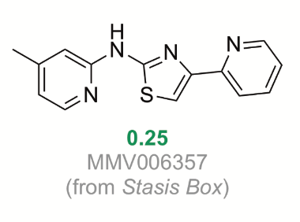

# Series-2-Aminothiazoles
Screening of the stasis box identified MMV006357 a 2-aminothiazole with useful activity. 

This compound is known in the literature and a search of ChEMBL identifies it as [CHEMBL476339](https://www.ebi.ac.uk/chembl/compound/inspect/CHEMBL476339). It has been screened extensively:

* Malaria Screening (GlaxoSmithKline)
* Malaria Screening (Novartis)
* Leishmania Screening (Saint Jude) 

In the literature it has been described as a potent Kca2.3 channel inhibitor (4 nM) [DOI](http://dx.doi.org/10.1016/j.bmcl.2008.08.023). This is a human calcium-activated potassium channel, does this channel or a homologue therof exist in ascomycota? 

As with all hits from screening - The first step should be to confirm activity with a fresh sample. If confirmed, a couple of approaches are possible.

Try to confirm the mode of action
------------

ChEMBL also contains details of several other molecules that are reported to be active at the same channel and it would be useful to evaluate them.

These include:
* The cyclic peptide Apimin (from honeybee venom) [CHEMBL525408](https://www.ebi.ac.uk/chembl/compound/inspect/CHEMBL525408) (0.064 nM)
* A interesting cyclic polyamine [CHEMBL3040285](https://www.ebi.ac.uk/chembl/compound/inspect/CHEMBL3040285) (31 nM) 
* This rather tame looking pyrazolo[1,5‐
a]pyrimidine [CHEMBL472452](https://www.ebi.ac.uk/chembl/compound/inspect/CHEMBL472452) (350 nM). 

_If these are active it adds support to potassium channel blockade being the MOA._ 

Exploring the SAR of 2-Aminothiazoles
----------
This structural class is well known in the literature and rather than embark on synthesis it would seem logical to see if we can access samples prepared for other projects.

A number of analogues were made in an [leishmania project](http://dx.doi.org/10.1016/j.ejmech.2015.08.013) - seems to have been a DNDI project - can we get samples?

[This interesting antimalarial screen](https://doi.org/10.1016/j.bmc.2013.08.048) - would not hurt to ask for samples? 
